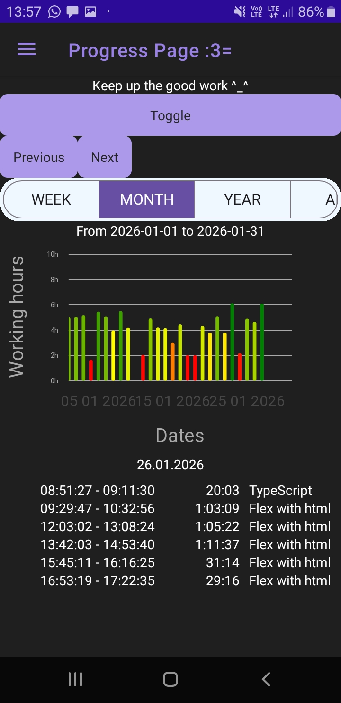
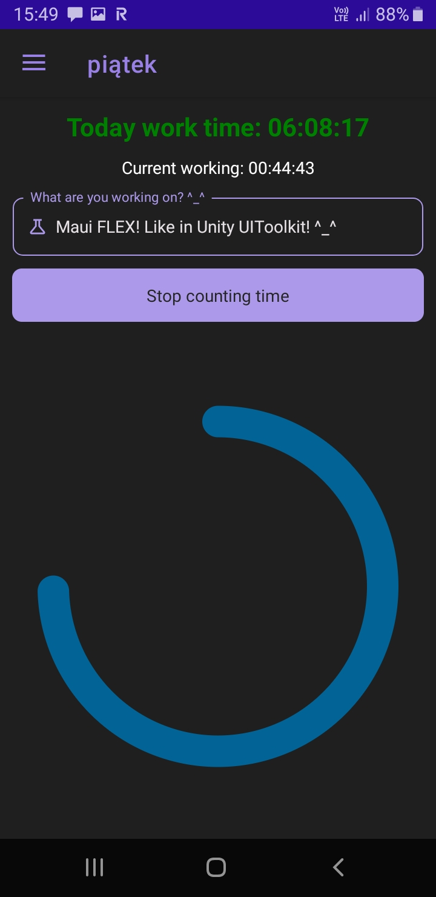

 

  
  

🕑Time tracking app written in .net MAUI  
  
I really like using it, helps me organize my work time :)
## What .net MAUI compoments were used:

<ul>
<li>MVVM</li>
<li>.net MAUI Community Toolkit</li>
<li>Uranium UI for some controls</li>
<li>Work time charts are made with LiveCharts2</li>
<li>Backup with pastebin api</li>
<li>Pomodoro view is made with GraphicsView</li>
<li>Supabase and SQLite local backup (in progress)</li>
</ul>

## App features

Detail summary of weekly, monthly and year time tracking with history:

Built in 1 hour pomodor timer, counting current learning span and whole day:

 

